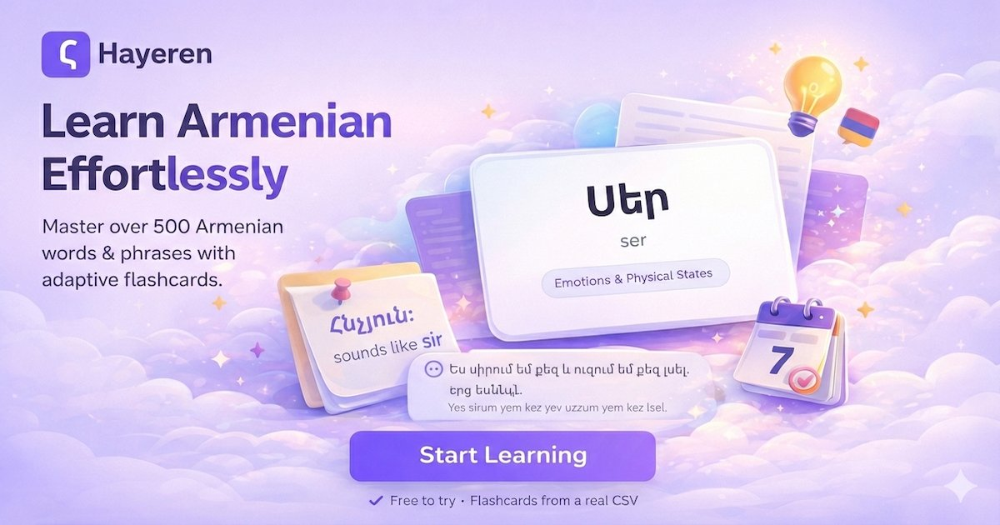
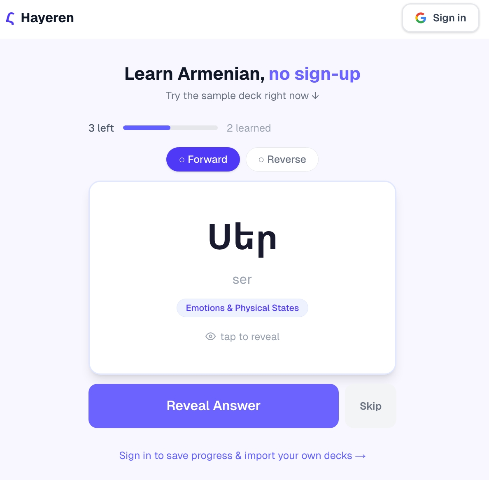
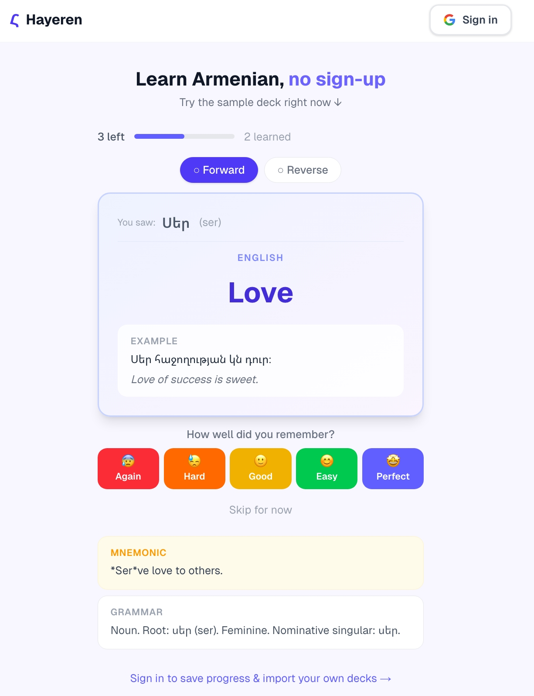

# Hayeren — Armenian Vocabulary Flashcards

<p align="center">
	
</p>

<p align="center">
	Learn Armenian with adaptive spaced repetition, bidirectional cards, and a beautiful study flow.
</p>

<p align="center">
	<a href="https://hayeren.mohammaddaryani.dev/"><strong>Live Demo</strong></a>
	·
	<a href="docs/API_REFERENCE.md"><strong>API Reference</strong></a>
	·
	<a href="docs/DEPLOYMENT_GUIDE.md"><strong>Deployment Guide</strong></a>
</p>

---

## 🌐 Live Project

Production is running at:

**https://hayeren.mohammaddaryani.dev/**

Try it instantly with the built-in sample deck (no sign-up required), or sign in with Google to save progress and manage your own decks.

## ✨ Highlights

- **FSRS-powered scheduling** for smarter review timing
- **Bidirectional learning** (Armenian → English and English → Armenian)
- **Guest mode** with sample deck for instant practice
- **Google OAuth** for persistent personal progress
- **CSV import/export** for real-world vocab workflows
- **Topic/Tag filtering** for focused study sessions
- **Mobile-friendly UI** built with Tailwind CSS

## 🖼️ Screenshots

### Open Graph image



### Guest Study (Card Front)



### Guest Study (Answer + Grading)



## 🧱 Tech Stack

- **Framework**: Next.js 16 + React 19 + TypeScript
- **Database**: PostgreSQL + Prisma 7
- **Authentication**: NextAuth.js (Google OAuth)
- **Scheduling**: FSRS-based custom SRS logic
- **Styling**: Tailwind CSS 4
- **CSV pipeline**: PapaParse + Zod validation

## 🚀 Quick Start (Local)

### Prerequisites

- Node.js 20+
- npm
- PostgreSQL 14+

### 1) Install dependencies

```bash
npm install
```

### 2) Configure environment

```bash
cp .env.example .env
```

Update `.env` values (database + Google OAuth).

### 3) Run database migrations

```bash
npx prisma migrate dev --name init
```

### 4) Start the app

```bash
npm run dev
```

Open `http://localhost:3000`.

## 🐳 Docker / Coolify

This repository includes `docker-compose.yml` and is ready for Coolify-style deployments.

```bash
docker compose up -d
```

Default production-style port in env examples is `3001`.

Use `.env.production.example` as your template for server deployment.

## 📚 Core Features

### Adaptive Study Loop

- Review cards and grade recall from **0–4** (`Again` to `Perfect`)
- FSRS adjusts interval and ease factor per response
- Lapses are tracked for recovery scheduling

### Mastery Model

A card is considered learned when both directions are recalled successfully (grade ≥ 2), enabling true bilingual recall.

### CSV Workflow

- Import vocab decks from CSV
- Update existing decks safely
- Export decks back to CSV
- Sample format included: [public/samples/vocab-import-sample.csv](public/samples/vocab-import-sample.csv)

Required CSV header:

```csv
difficulty,Armenian Script,Translit.,English Meaning,Example Sentence + [Translation],Grammar (Root/Infinitive + Imperative),Cheat Phrase (Mnemonic),Topic/Tag
```

## 🔌 API Overview

Main route groups:

- `api/auth/*` (NextAuth + guest migration)
- `api/decks/*` (CRUD, import/export, sample/seed)
- `api/study/*` (next card + review submission)

Detailed examples: [docs/API_REFERENCE.md](docs/API_REFERENCE.md)

## 🛠️ Development Commands

```bash
npm run dev      # start dev server
npm run build    # production build
npm run lint     # lint
npx prisma studio
```

## 📁 Project Structure

Key paths:

- `src/app` — app router pages + API routes
- `src/components` — UI components (study, decks, modals)
- `src/lib/srs` — FSRS and mastery logic
- `prisma/schema.prisma` — database schema
- `docs/` — deployment + API docs

## 🧭 Deployment Docs

- Production setup: [docs/DEPLOYMENT_GUIDE.md](docs/DEPLOYMENT_GUIDE.md)
- Extended operations notes: [docs/README_PRODUCTION.md](docs/README_PRODUCTION.md)

## 📄 License

MIT
